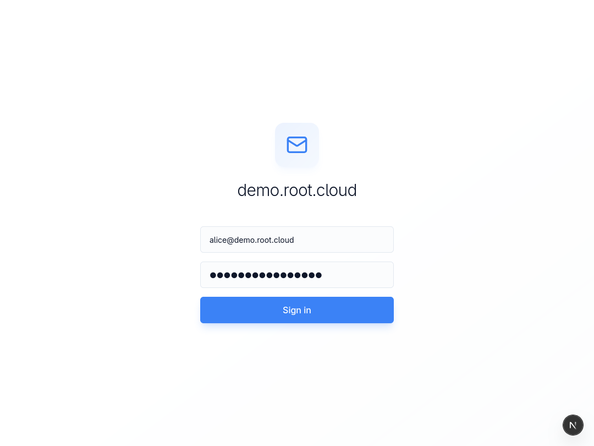
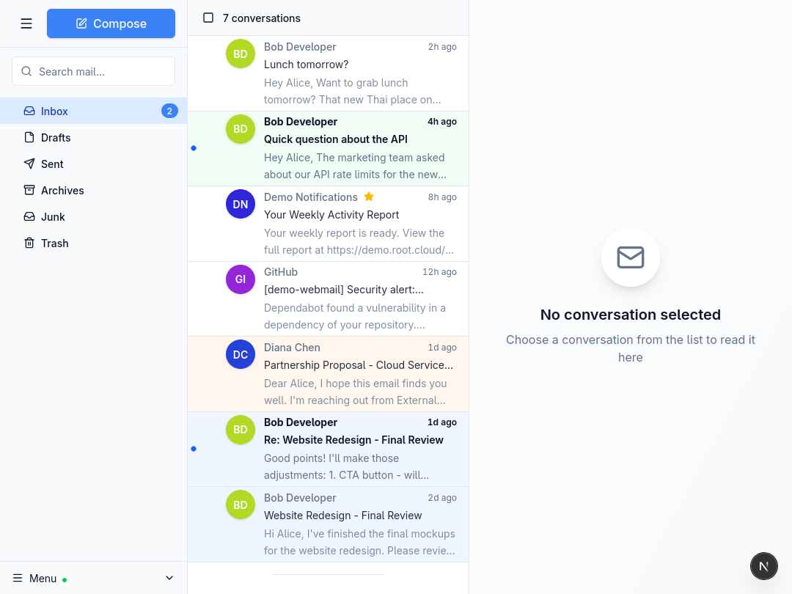
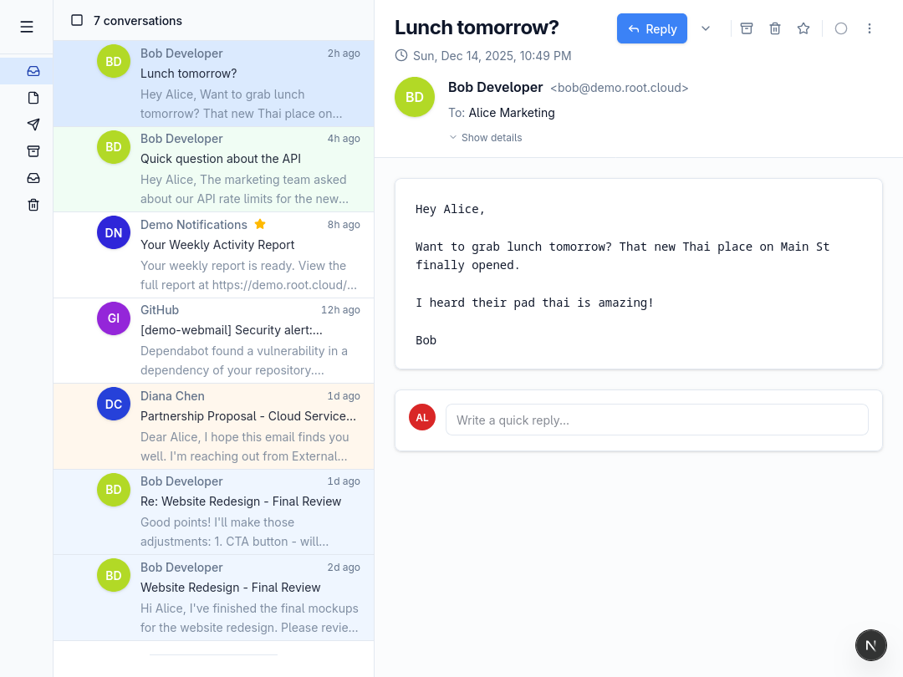
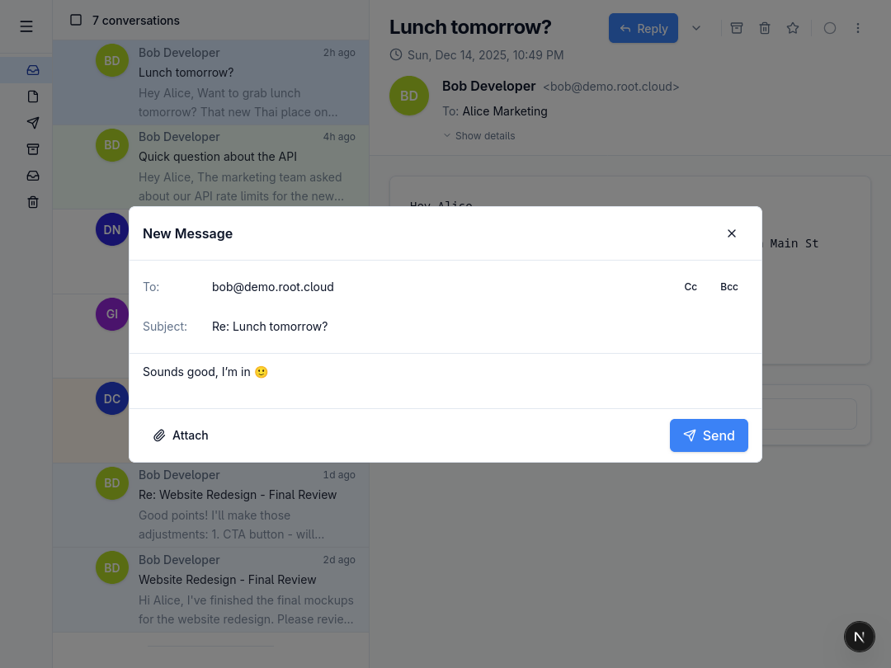
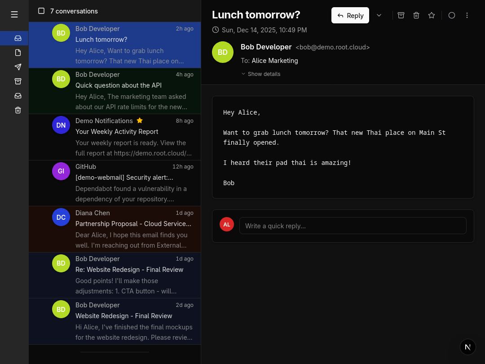
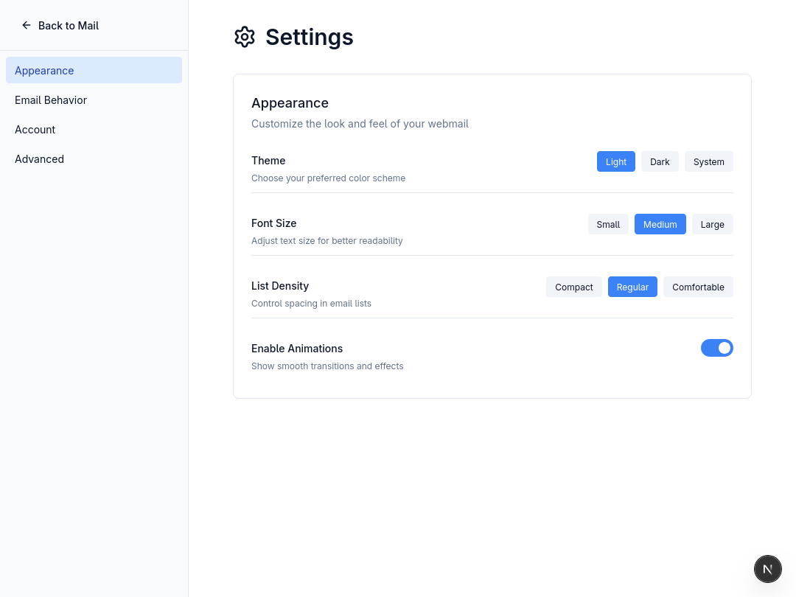
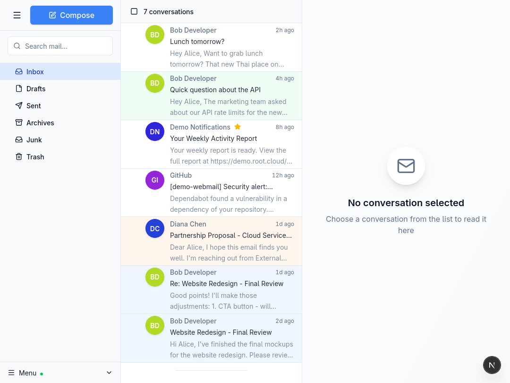

# JMAP Webmail

A modern, privacy-focused webmail client built with Next.js and the JMAP protocol.

## Screenshots

### Login


### Inbox


### Email Viewer


### Compose


### Dark Mode


### Settings


### Sidebar Navigation


## Features

- **Modern UI** - Clean, minimalist three-pane layout
- **Dark Mode** - Full dark theme support
- **Email Threading** - Gmail-style conversation view
- **Real-time Updates** - Push notifications for new emails
- **Keyboard Shortcuts** - Navigate efficiently with hotkeys
- **Drag & Drop** - Move emails between folders
- **Color Tags** - Organize emails with color labels
- **Attachments** - Upload and download file attachments
- **Search** - Full-text email search
- **i18n** - English and French language support
- **Mobile Responsive** - Adaptive layout for all screen sizes

## Tech Stack

- **Framework**: Next.js 16 with Turbopack
- **Styling**: Tailwind CSS v4
- **State**: Zustand
- **Protocol**: JMAP (RFC 8620)
- **i18n**: next-intl

## Getting Started

```bash
# Install dependencies
npm install

# Run development server
npm run dev
```

Open [http://localhost:3000](http://localhost:3000) and connect to your JMAP server.

## Configuration

Create a `.env.local` file:

```env
NEXT_PUBLIC_APP_NAME=Your Webmail
NEXT_PUBLIC_JMAP_SERVER_URL=https://your-jmap-server.com
```

## License

MIT
