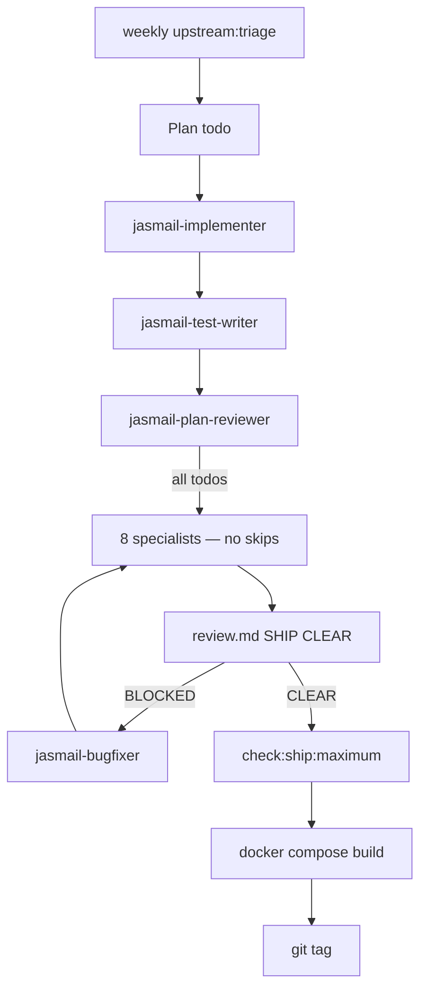

# JasMail Development Operating System

**Version:** 2.3.0 · **Mode:** `maximum` (Option C) · **Skills:** `.grok/skills/jasmail-*`

The JasMail dev OS ships **only** when all specialists report `SHIP CLEAR: 0` and maximum mechanical gates pass.

**Policy:** [DEV_OS_POLICY.md](DEV_OS_POLICY.md) — feel the pain, never get hacked.

## Quick start

```bash
# Daily (pre-commit)
npm run check:ship

# Weekly (mandatory)
npm run upstream:triage

# Before tagging vX.Y.Z
npm run diff:scope                            # maximum mode = all 8 specialists
# … /jasmail-dev-os through review + bugfix loops …
# Write docs/reviews/YYYY-MM-DD-vX.Y.Z-review.md
npm run check:ship:maximum -- --version X.Y.Z # build + dedupe + E2E + vuln scan + CVE check + artifact
git tag vX.Y.Z && git push fork main --tags   # pre-push enforces maximum gate
```

## Invoke in Grok

| Command | Action |
|---------|--------|
| `/jasmail-dev-os` | Full release cycle (maximum mode) |
| `/jasmail-upstream-maintainer` | Upstream merge — same pain as features |
| `/jasmail-implementer` | Single plan todo |
| `/jasmail-github-sync` | Push safe commits to fork; keep issues aligned (no tag) |

## Architecture (Option C)



## Specialist roster

All **8** reviewers run on every release (no `diff:scope` skips in maximum mode).

| Skill | Role |
|-------|------|
| [jasmail-dev-os](../.grok/skills/jasmail-dev-os/SKILL.md) | Orchestrator |
| [jasmail-upstream-maintainer](../.grok/skills/jasmail-upstream-maintainer/SKILL.md) | Upstream merge (+8th on merges) |
| [jasmail-implementer](../.grok/skills/jasmail-implementer/SKILL.md) | Implementation |
| [jasmail-code-reviewer](../.grok/skills/jasmail-code-reviewer/SKILL.md) | General quality |
| [jasmail-security-reviewer](../.grok/skills/jasmail-security-reviewer/SKILL.md) | Auth, JMAP, SQL |
| [jasmail-vulnerability-reviewer](../.grok/skills/jasmail-vulnerability-reviewer/SKILL.md) | CVEs, secrets, exploits |
| [jasmail-test-reviewer](../.grok/skills/jasmail-test-reviewer/SKILL.md) | Coverage |
| [jasmail-plan-reviewer](../.grok/skills/jasmail-plan-reviewer/SKILL.md) | Plan ↔ code |
| [jasmail-a11y-reviewer](../.grok/skills/jasmail-a11y-reviewer/SKILL.md) | Accessibility |
| [jasmail-i18n-reviewer](../.grok/skills/jasmail-i18n-reviewer/SKILL.md) | 10 locales |
| [jasmail-stack-maintainer](../.grok/skills/jasmail-stack-maintainer/SKILL.md) | Docker/compose |

Full index: [.grok/skills/README.md](../.grok/skills/README.md)

## Mechanical gates

| Command | Includes |
|---------|----------|
| `npm run check:ship` | lint, typecheck, test, locales |
| `npm run check:ship:full` | + build |
| `npm run check:ship:maximum` | + dedupe suite + Playwright E2E + `check:vulnerabilities` + upstream CVE check |

| Hook / CI | When |
|-----------|------|
| `.husky/pre-commit` | `check:ship` |
| `.husky/pre-push` | Tag → `check:ship:maximum --version` |
| `.github/workflows/ci.yml` | PR quick; main maximum |
| `.github/workflows/upstream-triage.yml` | Weekly Monday + CVE strict fail |

## Key documents

| Document | Purpose |
|----------|---------|
| [DEV_OS_POLICY.md](DEV_OS_POLICY.md) | **Option C binding policy** |
| [UPSTREAM_MERGE.md](UPSTREAM_MERGE.md) | Upstream merge procedure |
| [RELEASE_CHECKLIST.md](RELEASE_CHECKLIST.md) | Feature release sign-off |
| [UPSTREAM_MERGE_CHECKLIST.md](UPSTREAM_MERGE_CHECKLIST.md) | Merge sign-off |

## Golden rules

1. **No tag** without review artifact `SHIP CLEAR: 0`
2. **No CVE defer** without `MERGE_LOG` risk note
3. **No upstream merge** without `check:ship:maximum`
4. **You review upstream** — agents execute the pipeline