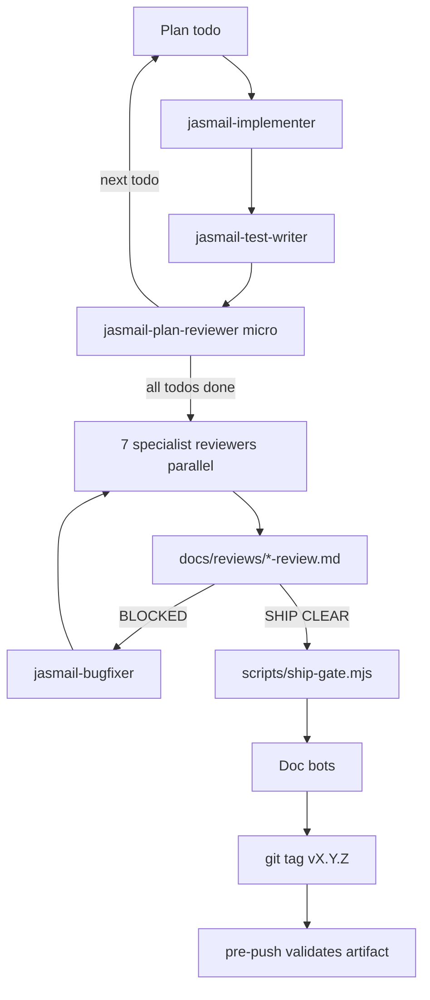

# JasMail Development Operating System

**Version:** 2.0.0 · **Skills path:** `.grok/skills/jasmail-*`

The JasMail dev OS is an agent-orchestrated release pipeline that ships **only** when all specialists report `SHIP CLEAR: 0` and mechanical gates pass.

## Quick start

```bash
# Contributor daily loop
npm run check:ship          # lint + typecheck + test + locales

# Before tagging vX.Y.Z
node scripts/diff-scope.mjs                    # which reviewers to run
# … run /jasmail-dev-os through review + bugfix loops …
# Write docs/reviews/YYYY-MM-DD-vX.Y.Z-review.md from TEMPLATE.md
npm run check:ship:full -- --version X.Y.Z     # build + review artifact
git tag vX.Y.Z && git push fork main --tags    # pre-push hook enforces gates
```

## Invoke in Grok

| Command | Action |
|---------|--------|
| `/jasmail-dev-os` | Full release cycle for active milestone |
| `/jasmail-implementer` | Single plan todo |
| `/jasmail-code-reviewer` | General review (or full round via orchestrator) |

## Architecture



## Specialist roster

| Skill | Role |
|-------|------|
| [jasmail-dev-os](../.grok/skills/jasmail-dev-os/SKILL.md) | Orchestrator |
| [jasmail-implementer](../.grok/skills/jasmail-implementer/SKILL.md) | Implementation |
| [jasmail-test-writer](../.grok/skills/jasmail-test-writer/SKILL.md) | Tests per todo |
| [jasmail-code-reviewer](../.grok/skills/jasmail-code-reviewer/SKILL.md) | General quality |
| [jasmail-security-reviewer](../.grok/skills/jasmail-security-reviewer/SKILL.md) | Auth, JMAP, SQL |
| [jasmail-test-reviewer](../.grok/skills/jasmail-test-reviewer/SKILL.md) | Coverage |
| [jasmail-plan-reviewer](../.grok/skills/jasmail-plan-reviewer/SKILL.md) | Plan ↔ code |
| [jasmail-a11y-reviewer](../.grok/skills/jasmail-a11y-reviewer/SKILL.md) | Accessibility |
| [jasmail-i18n-reviewer](../.grok/skills/jasmail-i18n-reviewer/SKILL.md) | 10 locales |
| [jasmail-stack-maintainer](../.grok/skills/jasmail-stack-maintainer/SKILL.md) | Docker/compose |
| [jasmail-bugfixer](../.grok/skills/jasmail-bugfixer/SKILL.md) | Fix findings |
| [jasmail-release-notes](../.grok/skills/jasmail-release-notes/SKILL.md) | Changelogs |
| [jasmail-tester-docs](../.grok/skills/jasmail-tester-docs/SKILL.md) | QA tasks |
| [jasmail-product-features](../.grok/skills/jasmail-product-features/SKILL.md) | Feature catalog |
| [jasmail-github-issues](../.grok/skills/jasmail-github-issues/SKILL.md) | Issue sync |

Full index: [.grok/skills/README.md](../.grok/skills/README.md)

## Mechanical gates (automation)

| Script | Purpose |
|--------|---------|
| `scripts/ship-gate.mjs` | Lint, typecheck, test, locales; `--full` adds build; `--version` validates review |
| `scripts/validate-review-artifact.mjs` | Requires `SHIP CLEAR: 0` in `docs/reviews/` |
| `scripts/diff-scope.mjs` | JSON: which conditional reviewers to run |
| `scripts/check-locales.mjs` | 10-locale key parity vs `en` |
| `scripts/sync-locales.mjs` | Copy missing keys from `en` (keeps translations) |
| `scripts/record-review-metrics.mjs` | Append learning metrics to `metrics.jsonl` |

| Hook / CI | When |
|-----------|------|
| `.husky/pre-commit` | `npm run check:ship` |
| `.husky/pre-push` | On tag: review artifact + full ship-gate |
| `.github/workflows/ci.yml` | Every push/PR to `main` |

## Key documents

| Document | Purpose |
|----------|---------|
| [RELEASE_CHECKLIST.md](RELEASE_CHECKLIST.md) | Per-release sign-off |
| [reviews/TEMPLATE.md](reviews/TEMPLATE.md) | Review artifact template |
| [reviews/RETROSPECTIVE_TEMPLATE.md](reviews/RETROSPECTIVE_TEMPLATE.md) | Post-release learning |
| [DEV_OS_MAINTENANCE.md](DEV_OS_MAINTENANCE.md) | Upgrade skills & patterns |
| [plans/](plans/) | Milestone design docs |

## Golden rule

**No `git tag` without `docs/reviews/*-vX.Y.Z-review.md` containing `Final verdict: SHIP CLEAR: 0`.**

The pre-push hook enforces this mechanically.