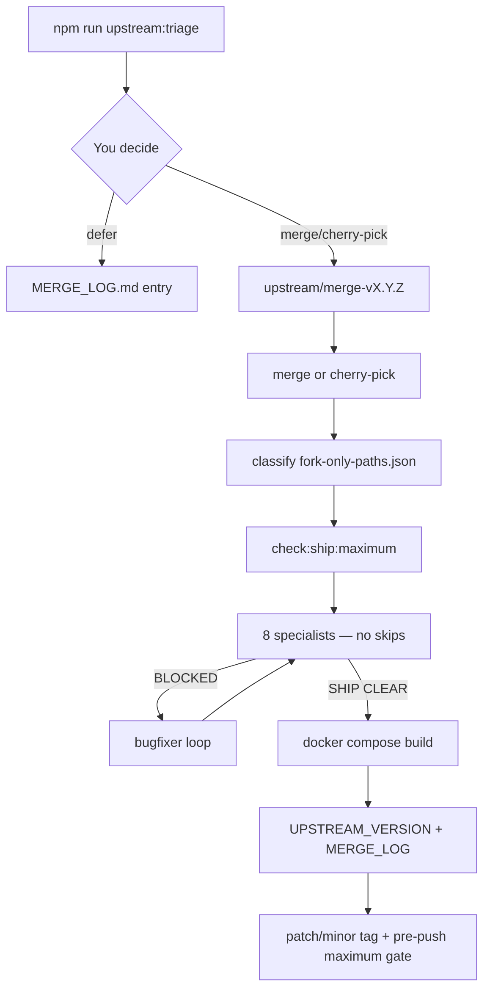

# Upstream merge workflow (Option C — Maximum Quality)

JasMail forks [root-fr/jmap-webmail](https://github.com/root-fr/jmap-webmail). **You review; agents execute.** No blind merges, no shortcuts — CVEs run the same full pipeline as features.

Policy: [DEV_OS_POLICY.md](DEV_OS_POLICY.md)

## Remotes

| Remote | URL | Use |
|--------|-----|-----|
| `fork` | `jasincanada/JasMail` | Push releases |
| `origin` (fetch) | `root-fr/jmap-webmail` | Fetch upstream only |

```bash
git fetch origin          # upstream
git push fork main        # fork
```

## Weekly triage (mandatory)

```bash
npm run upstream:triage
```

CI runs this every Monday. When upstream is ahead, **you** decide: merge, cherry-pick, or defer (with `MERGE_LOG` entry).

## When upstream ships

| Signal | Option C action |
|--------|-----------------|
| **CVE / security** | Start `/jasmail-upstream-maintainer` within 7 days — **full pipeline**, no fast lane |
| **Shared-code fix** | Review → full merge or cherry-pick (cherry-pick still gets full checklist) |
| **New upstream feature** | Review → merge only if you want it; else defer with log entry |
| **Docs/screenshots only** | Defer or merge — if merged, still full specialists + gates |

**Forbidden:** silent defer, cherry-pick without security reviewer, skipping dedupe regression.

## Merge procedure



### 1. Preflight

```bash
npm run upstream:triage
git status   # clean working tree
git checkout main && git pull fork main
```

### 2. Merge branch

```bash
git checkout -b upstream/merge-v1.5.3
git merge origin/main -m "merge upstream v1.5.3"
# cherry-pick: git cherry-pick <sha>  — same checklist applies
```

### 3. Conflict rules

See `docs/upstream/fork-only-paths.json`:

| Category | Resolution |
|----------|------------|
| **fork-only** (dedupe, dev OS, JasMail docs) | Keep **ours** |
| **upstream-owned** (`CHANGELOG.md`, `ROADMAP.md`) | Upstream text in upstream sections |
| **shared-hotspot** | Manual — preserve dedupe hooks **and** upstream fixes |
| **shared** | Prefer upstream behavioral fix; run tests |

### 4. Gates (maximum — no shortcuts)

```bash
UPSTREAM_MERGE=1 npm run diff:scope          # 8 specialists
npm run check:ship:maximum                   # lint, test, build, dedupe, E2E, CVE check
cd /home/jas/dockersites/email && docker compose build jasmail
```

### 5. Review artifact (required)

`docs/reviews/YYYY-MM-DD-upstream-vX.Y.Z-merge.md` with:

- Your merge/cherry-pick/defer decision rationale
- All 8 specialist verdicts
- Conflict resolution table
- `Final verdict: SHIP CLEAR: 0`

Checklist: [UPSTREAM_MERGE_CHECKLIST.md](UPSTREAM_MERGE_CHECKLIST.md)

### 6. Pin baseline

Update `UPSTREAM_VERSION` and append [MERGE_LOG.md](upstream/MERGE_LOG.md).

### 7. Release

Every upstream merge that ships to users gets a tag. `pre-push` runs `check:ship:maximum --version X.Y.Z`.

JasMail semver ≠ upstream semver.

## Integration with Dev OS

| Path | Command |
|------|---------|
| Weekly check | `npm run upstream:triage` |
| Upstream merge | `/jasmail-upstream-maintainer` |
| Feature release | `/jasmail-dev-os` (also maximum mode — all specialists) |

Phase 0 blocks feature work when `upstream:status` reports `cve-pending`.