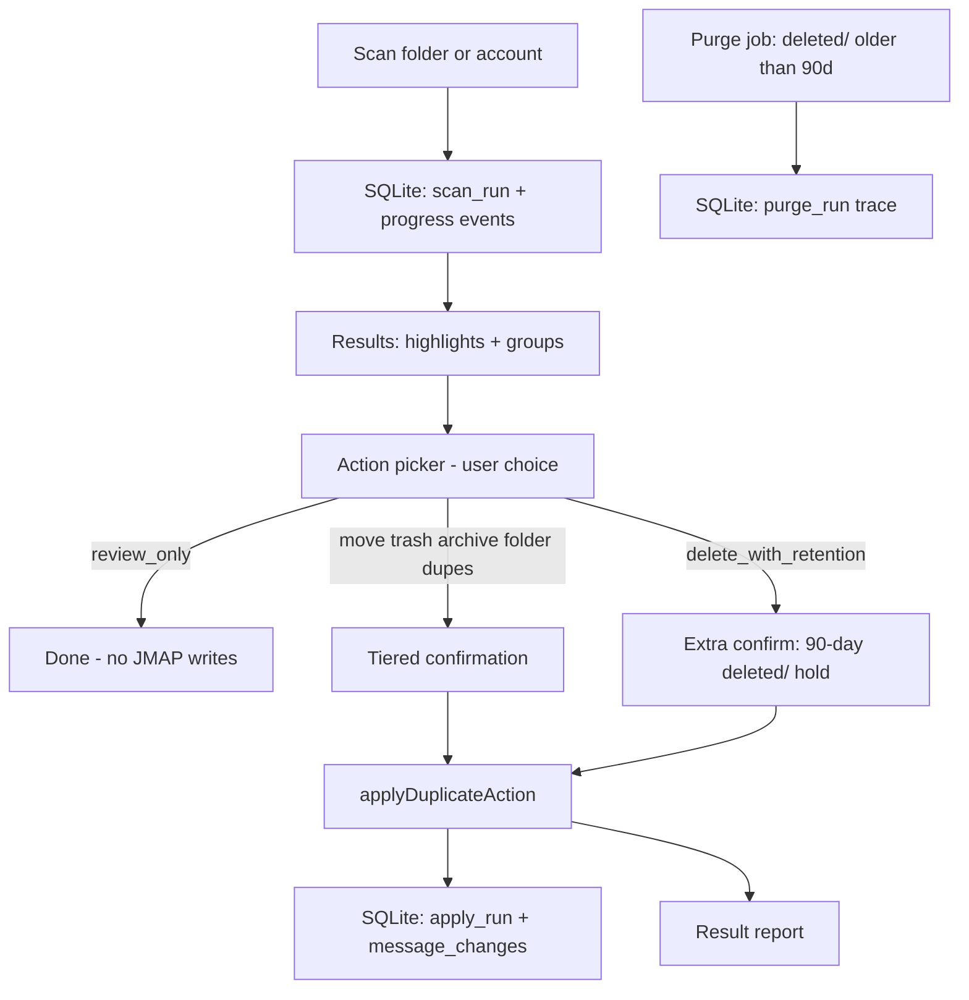

> Redesign JasMail duplicate handling to be scan-first and user-confirmed (non-destructive by default), with a core action framework designed for future extensibility—not a Thunderbird clone.

# Duplicate handling redesign (user-driven + extensible + auditable)

## User preferences (remember)

- **Not Thunderbird-like.** Thunderbird is admired for its **plugin ecosystem and extensibility**, not as a UX template. JasMail should build a **better framework** for extensions, not copy RemoveDupes flows.
- **Non-destructive by default.** Scan and review only until the user explicitly chooses an action.
- **No automatic manipulation (early stage).** Unsafe to scan-and-move in one step; separate detect → review → decide → confirm → apply.
- **v1.7 extensibility scope:** **Core interfaces + built-in actions only**; plugin API **designed** but **not shipped** to third parties yet.
- **Audit & retention (review comment):** Dedupe operations must **persist to SQLite** (server-side in Docker), track scan/apply **progress**, trace every message change, and route delete-tier actions through a **`deleted/` folder with 90-day retention** before permanent purge.

---

## Design principles

| Principle | Implementation |
|-----------|----------------|
| Detect ≠ remediate | Scan never writes to JMAP mailboxes |
| Explicit consent | Every write requires Apply + tiered confirmation |
| Keeper safety net | One message per group kept unless user overrides (v1.8) |
| Reversible first | Trash / archive / folder move before hard delete |
| Auditable | Every scan + apply logged to SQLite with message-level trace |
| Soft delete | Delete actions → `deleted/` subfolder, 90-day hold, then auto-purge |
| Extensible core | Actions implement a shared interface; registry ready for future plugins |

---

## Current state (v1.6.5) — what changes

**Keep:** batched scan, match criteria, highlight banner, operations page groups, large-folder confirm, abort/cancel, `lib/mail-dedupe.ts` scan paths.

**Retire/demote:**
- `?action=remove` auto-start and one-click “Remove duplicates” entry points
- Hardcoded `dupes/` as implicit default action
- Coupled `runFolderDedupe` / `runMailboxDedupe` (scan + move)
- Immediate permanent delete as a dedupe outcome (replaced by `deleted/` retention)

**Key files today:**
- [`components/dedupe/dedupe-operations-view.tsx`](components/dedupe/dedupe-operations-view.tsx) — auto-start remove flow
- [`lib/mail-dedupe.ts`](lib/mail-dedupe.ts) — `runFolderDedupe`, `runMailboxDedupe`, `DUPES_FOLDER`
- [`components/settings/dedupe-settings.tsx`](components/settings/dedupe-settings.tsx) — “Remove duplicates” navigate
- [`components/layout/sidebar.tsx`](components/layout/sidebar.tsx) — context menu remove

---

## Target flow



No JMAP mailbox writes on page load. No writes without **Apply**.

---

## SQLite audit layer (server-side, Docker)

**Decision:** SQLite lives **server-side** in the `jasmail` container, volume-mounted at `/data/dedupe-audit.db` (survives restarts; shared audit trail per deployment).

### New API routes (`app/api/dedupe/`)

| Route | Purpose |
|-------|---------|
| `POST /api/dedupe/runs` | Start scan or apply run; returns `runId` |
| `PATCH /api/dedupe/runs/:id/progress` | Append progress events (folder, position, message) |
| `POST /api/dedupe/runs/:id/changes` | Batch-insert message change records after each JMAP batch |
| `GET /api/dedupe/runs/:id` | Resume/progress UI + audit detail |
| `GET /api/dedupe/runs` | List recent runs (operations history page, v1.8) |
| `POST /api/dedupe/purge` | Trigger or record 90-day `deleted/` purge (cron or manual) |

Auth: same session as existing `/api/auth` — dedupe audit is per logged-in account (`accountId` + `userId` in every row).

### Schema (minimal v1.7)

```sql
-- lib/dedupe-audit/schema.sql
CREATE TABLE dedupe_runs (
  id            TEXT PRIMARY KEY,
  account_id    TEXT NOT NULL,
  type          TEXT NOT NULL,  -- 'scan' | 'apply' | 'purge'
  status        TEXT NOT NULL,  -- 'running' | 'paused' | 'complete' | 'error' | 'cancelled'
  scope         TEXT NOT NULL,  -- 'folder' | 'account'
  mailbox_id    TEXT,
  action_id     TEXT,           -- null for scan-only
  started_at    INTEGER NOT NULL,
  completed_at  INTEGER,
  stats_json    TEXT            -- scanned, duplicates, affected, etc.
);

CREATE TABLE dedupe_progress (
  id         INTEGER PRIMARY KEY AUTOINCREMENT,
  run_id     TEXT NOT NULL REFERENCES dedupe_runs(id),
  ts         INTEGER NOT NULL,
  folder     TEXT,
  position   INTEGER,
  total      INTEGER,
  message    TEXT
);

CREATE TABLE dedupe_message_changes (
  id              INTEGER PRIMARY KEY AUTOINCREMENT,
  run_id          TEXT NOT NULL REFERENCES dedupe_runs(id),
  email_id        TEXT NOT NULL,
  group_key       TEXT,
  from_mailbox_id TEXT NOT NULL,
  to_mailbox_id   TEXT,          -- null if destroyed after retention
  action_id       TEXT NOT NULL,
  keeper          INTEGER NOT NULL DEFAULT 0,  -- 1 = kept in place
  changed_at      INTEGER NOT NULL,
  purge_after     INTEGER          -- set for deleted/ moves (changed_at + 90d)
);

CREATE INDEX idx_changes_run ON dedupe_message_changes(run_id);
CREATE INDEX idx_changes_purge ON dedupe_message_changes(purge_after) WHERE purge_after IS NOT NULL;
```

### Client integration

- `lib/dedupe-audit/client.ts` — thin fetch wrapper called from scan/apply loops
- Scan loop: `PATCH progress` after each batch (enables resume UI in v1.8)
- Apply loop: `POST changes` after each JMAP batch (full trace)
- On cancel: `status = cancelled` in SQLite

### Docker / compose

```yaml
# docker-compose.yml — jasmail service
volumes:
  - jasmail-dedupe-data:/data
environment:
  DEDUPE_AUDIT_DB_PATH: /data/dedupe-audit.db
  DEDUPE_DELETED_RETENTION_DAYS: 90
```

Use `better-sqlite3` in Next.js standalone server (API routes only; not bundled to client).

---

## `deleted/` folder + 90-day retention

Parallel to existing `dupes/` pattern (`ensureDupesMailbox` in `lib/mail-dedupe.ts`):

| Folder | Purpose | Created when |
|--------|---------|--------------|
| `dupes/` | User-opt-in quarantine for duplicates | User picks `move_to_dupes` |
| `deleted/` | Soft-delete holding area | User picks `delete_with_retention` |

### New built-in action: `delete_with_retention` (v1.7)

- **Tier 2** confirmation (not tier 3 immediate destroy)
- Moves duplicate messages (not keeper) to `deleted/` subfolder under source parent
- `ensureDeletedMailbox()` — same pattern as `ensureDupesMailbox`, folder name `deleted`
- SQLite `dedupe_message_changes.purge_after = changed_at + 90 days`
- **No** `Email/set destroy` in v1.7 apply path

### Purge job

- Runs daily (docker cron sidecar or `setInterval` in server process)
- Query SQLite for `purge_after < now()` where not yet purged
- JMAP `Email/set destroy` for those ids
- Log `dedupe_runs` type `purge` + per-message trace
- User-facing: Settings → Duplicates → “Retention: 90 days in deleted/” (read-only in v1.7)

### Rename / demote old `delete_permanent`

- v2 only, behind `allowDestructiveActions` + typed `DELETE` confirm
- v1.7 delete path **always** uses `deleted/` retention

---

## Action framework (extensibility-first, not Thunderbird)

### Core types (new: `lib/dedupe-actions/`)

```typescript
interface DedupeActionDefinition {
  id: DedupeActionId;
  labelKey: string;
  tier: 0 | 1 | 2 | 3;
  requiresDestination: boolean;
  destructive: boolean;       // true for delete_with_retention (soft)
  usesRetentionFolder: boolean; // true → deleted/
  enabled: (ctx: DedupeActionContext) => boolean;
}

interface DedupeActionExecutor {
  id: DedupeActionId;
  preview(scan: DedupeScanResult, opts: DedupeApplyOptions): DedupeApplyPreview;
  execute(client, scan, opts, signal, audit: DedupeAuditWriter): Promise<DedupeApplyResult>;
}
```

Executors **must** call `audit.recordChange()` for every message touched.

### Built-in actions (v1.7)

| ID | Tier | Shipped | Notes |
|----|------|---------|-------|
| `review_only` | 0 | Yes | Default; SQLite scan log only |
| `move_to_folder` | 1 | Yes | User picks destination |
| `move_to_dupes` | 1 | Yes | Opt-in; create `dupes/` on apply |
| `move_to_trash` | 2 | Yes | Account Trash role |
| `move_to_archive` | 2 | Yes | Account Archive role |
| `delete_with_retention` | 2 | Yes | **`deleted/` + 90-day hold** |
| `delete_permanent` | 3 | **v2** | Opt-in; bypasses retention |

---

## UX changes

### Entry points (v1.7)

- **Sidebar:** “Scan for duplicates” only
- **Settings:** “Scan account” + “Open duplicate review”
- **Operations page:** After scan → **“Choose action…”**
- **URL:** `action=scan` only; `action=remove` → redirect to scan + action picker

### Action picker (`components/dedupe/dedupe-action-picker.tsx`)

- Radio list from registry
- `delete_with_retention` shows: “Duplicates move to **deleted/** and are permanently removed after **90 days**.”
- Keeper policy: oldest (default) | newest
- Scope: folder | account

### Operations history (v1.8 UI, v1.7 data)

- SQLite already stores runs; v1.8 adds “Audit log” tab on `/dedupe` listing scans/applies with drill-down to message changes

---

## Architecture refactor

### `lib/mail-dedupe.ts`

- Keep: scan functions
- Add: `applyDuplicateAction(..., auditWriter)`
- Add: `ensureDeletedMailbox()` (mirror `ensureDupesMailbox`)
- Deprecate: `runFolderDedupe`, `runMailboxDedupe`

### New modules

| Path | Role |
|------|------|
| `lib/dedupe-audit/db.ts` | better-sqlite3 init, migrations |
| `lib/dedupe-audit/writer.ts` | `DedupeAuditWriter` interface |
| `lib/dedupe-audit/client.ts` | Browser → API client |
| `lib/dedupe-actions/registry.ts` | Built-in action registry |
| `lib/dedupe-actions/builtins/*.ts` | Per-action executors |

### `stores/dedupe-operations-store.ts`

- Phase `removing` → `applying`
- Add: `runId` (SQLite), `pendingAction`, `applyResult`

### `stores/dedupe-action-store.ts` (persisted preferences)

- `lastChosenAction`, `defaultDestinationMailboxId`, `keeperPolicy`
- `allowDestructiveActions: false` (v2)
- Preferences pre-fill picker only; **never auto-run**

---

## Phased rollout

### v1.7 — Safety pivot + action framework + SQLite audit

- Scan/apply split; action picker; built-in executors
- **Server SQLite** audit DB + API routes + Docker volume
- Progress events during scan/apply
- Message-level change trace
- `delete_with_retention` → `deleted/` + 90-day `purge_after` in DB
- Daily purge job (destroy after retention)
- Remove auto-remove entry points
- Tests: registry, apply routing, audit API, retention math, purge selection

### v1.8 — Trust & control

- Resume interrupted scan from SQLite progress
- Operations audit log UI
- Per-group keeper override
- Apply to selected groups only
- Export scan/audit report (CSV)

### v2.0 — Extensions

- Public `dedupe.actions` plugin manifest
- `delete_permanent` (bypass retention, opt-in)
- CLI `dedupe.py` shares SQLite schema on same volume
- Near-duplicate module

---

## Decisions locked in

| Question | Decision |
|----------|----------|
| Thunderbird as model? | **No** — extensibility inspiration only |
| SQLite location? | **Server-side** in jasmail Docker container |
| Delete behavior v1.7? | **`deleted/` folder, 90-day retention**, then auto-purge |
| Permanent delete? | **v2 only**, opt-in |
| Keep `dupes/` option? | **Yes**, opt-in |
| Account-wide apply? | **Yes**, extra confirmation |
| Extensibility v1.7 | **Interfaces + built-ins** |

---

## Success criteria (v1.7)

- Zero JMAP mailbox writes during scan
- Zero writes without explicit Apply + confirmation
- Every scan and apply creates a SQLite `dedupe_runs` row with progress events
- Every moved/retained message has a `dedupe_message_changes` row (email_id, from, to, action, purge_after)
- `delete_with_retention` moves to `deleted/`, not Trash and not immediate destroy
- Purge job removes messages ≥90 days after `deleted/` move, with purge traced in SQLite
- User can: scan → pick Trash → confirm → complete (full audit trail queryable via API)
- Old `action=remove` bookmarks redirect safely
- 733+ existing tests pass; new tests for apply path, audit API, retention, purge

## Todos

- [ ] **dedupe-audit-db** — SQLite schema, better-sqlite3, migrations, Docker volume, API routes
- [ ] **core-interfaces** — `lib/dedupe-actions/` types, registry, built-in executors (incl. `delete_with_retention`)
- [ ] **deleted-folder** — `ensureDeletedMailbox()`, retention constants, purge job
- [ ] **split-scan-apply** — `applyDuplicateAction()` + audit writer hooks; deprecate coupled run helpers
- [ ] **remove-auto-remove** — Remove `action=remove` auto-start; redirect; strip sidebar/settings remove
- [ ] **action-picker-ui** — Action picker + tiered confirm; wire into operations view post-scan
- [ ] **stores-prefs** — `dedupe-action-store` + operations store `runId`/phases
- [ ] **i18n-tests-release** — Locales, audit/retention copy, tests, ship v1.7